# Лаборатория инженерно-технических экспертиз
### Место расположения:
Главный учебный корпус, помещение 309

### Назначение лаборатории: проведение лабораторных и практических занятий по дисциплинам:
1.	Судебная фотография и видеозапись.
2.	Трасология и трасологические экспертизы.
3.	Технико-криминалистическая экспертиза документов.
4.	Криминалистическое исследование веществ, материалов и изделий.
5.	Криминалистика.
6.	Пожарно-техническая экспертиза.

Основная цель лаборатории – оптимизация учебного процесса, повышение качества преподавания ряда дисциплин судебно-экспертной направленности, формирование практических навыков в экспертной деятельности.

Основные задачи работы лаборатории:
- расширение знаний обучающихся в области криминалистики и судебной экспертизы;
- формирование у обучающихся практических навыков и умений, связанных с проведением различных следственных действий по обнаружению, предварительному исследованию и фиксации объектов-носителей информации.

### Назначение: 
проведение практических занятий и упражнений по дисциплинам: 

**1) специальности 40.05.03 Судебная экспертиза:**
- криминалистика;
- криминалистическое исследование веществ, материалов и изделий;
- судебная фотография и видеозапись;
- трасология и трасологические экспертизы;
- пожарно-техническая экспертиза.

**2) специальности 20.05.01 Пожарная безопасность:**
- расследование пожаров;
- экспертиза пожаров.

**3) специальности 20.03.01 Техносферная безопасность (с учетом года набора обучающихся):**
- экспертиза пожаров;
- расследование пожаров.
### Оборудование лаборатории инженерно-технических экспертиз:
### Ультразвуковой дефектоскоп

Применяется для поиска зон наибольших и наименьших термических повреждений, установления очага пожара при отсутствии визуальных очаговых признаков, а также с целью реконструкции возникновения и распространения пожара на основе ультразвукового исследования стен, перегородок и перекрытий жилых и производственных помещений. применяется для исследования бетонных и железобетонных конструкций.
Принцип работы устройства основан на измерении скорости прохождения ультразвуковой волны в приповерхностном слое бетона, учитывая факт изменения акустических свойств каменных конструкций при воздействии на них высокой температуры пожара.

### Коэрцитиметр Novotest

Применяется для исследования после пожара металлических (преимущественно стальных) конструкций, а также различных металлических крепежных изделий с целью установления на пожаре зон наибольших термических повреждений, поиска очага пожара и реконструкции возникновения и распространения горения.
Принцип работы устройства основан на измерении коэрцитивной силы (величины тока размагничивания) на элементах холоднодеформированных стальных конструкций, учитывая факт изменения магнитных свойств металлов при воздействии на них высокой температуры пожара.

### Газоанализатор АНТ-3

Используется для поиска на месте пожара зон, в которых превышена концентрация газопаровоздушных смесей на основе ЛВЖ и ГЖ (используемых злоумышленниками в качестве инициаторов горения), а также для определения концентрации паров светлых нефтепродуктов, спиртов, ацетона, аммиака. Применяется при отработке версии о поджоге, поиске очага пожара, а также реконструкции возникновения аварийных ситуаций на производственных объектах. 
Принцип работы устройства основан на фотоинозационном детектировании газов и паров легковоспламеняющихся и горючих жидкостей нефтяного и ненефтяного ряда. 

### Комплект пожарно-криминалистический
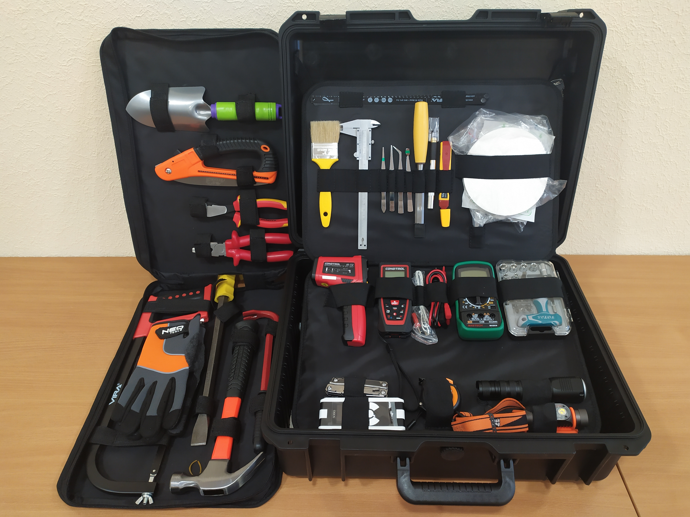
Комплекс инструментов и приборов для работы эксперта/криминалиста/дознавателя на месте пожара (аварии) предназначен для осуществления деятельности по поиску, фиксации и упаковке следов преступления, изъятия объектов для дальнейшего лабораторного исследования, а также для производства осмотра места происшествия в обстановке, сложившейся после пожара на различных объектах защиты.

### Тепловизор Testo
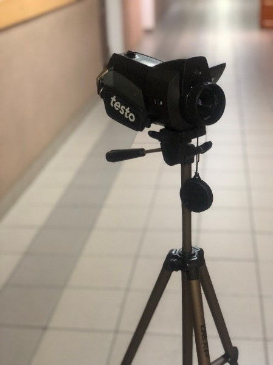

Устройство предназначено для тепловизионного исследования конструкций и предметов в инфракрасном диапазоне длин волн, с целью обнаружения зон наибольших и наименьших термических повреждений конструкций из неорганических материалов (каменные, стальные конструкции) в условиях отсутствия визуальных очаговых признаков.

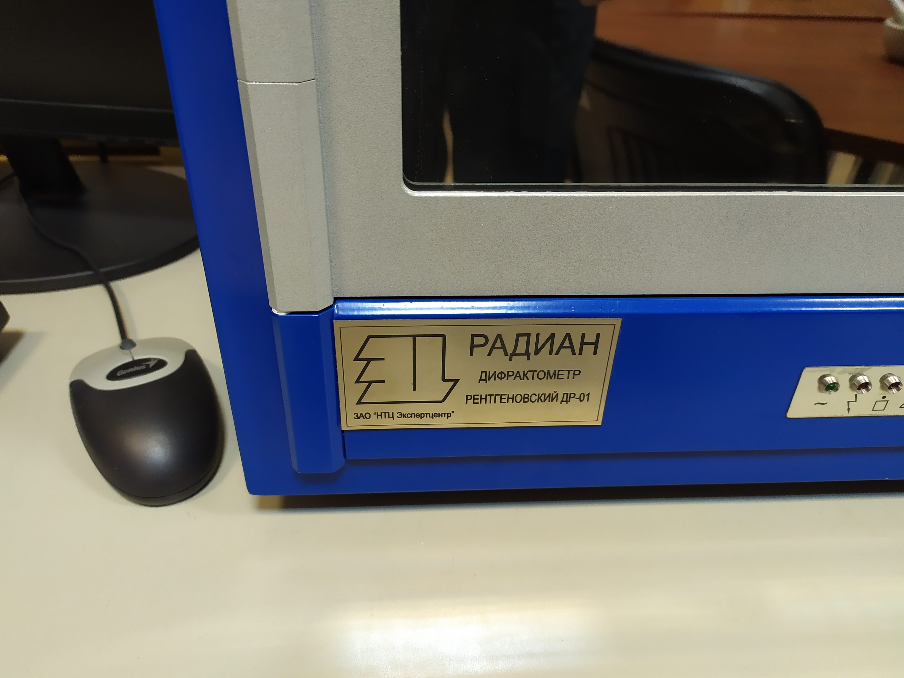
трынь
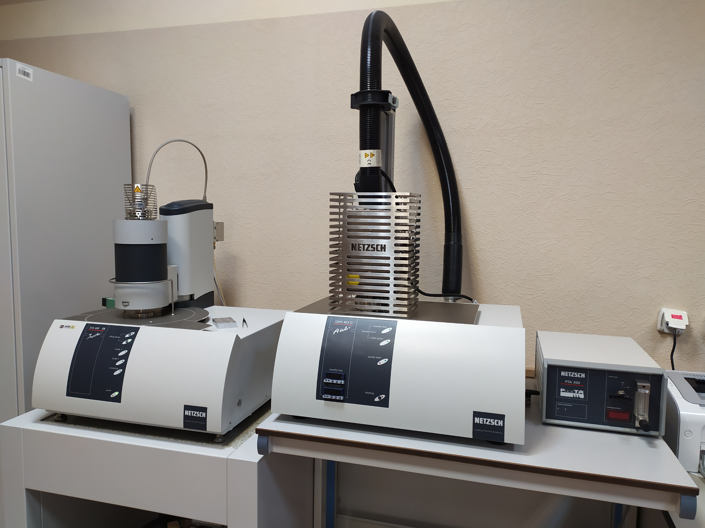
пум 
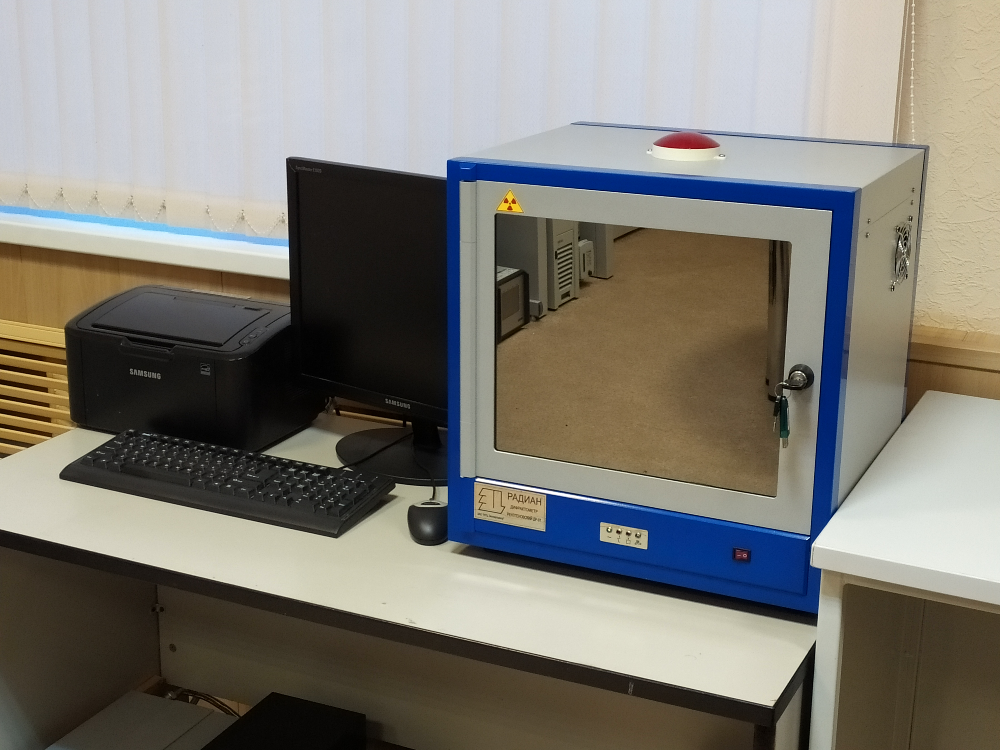
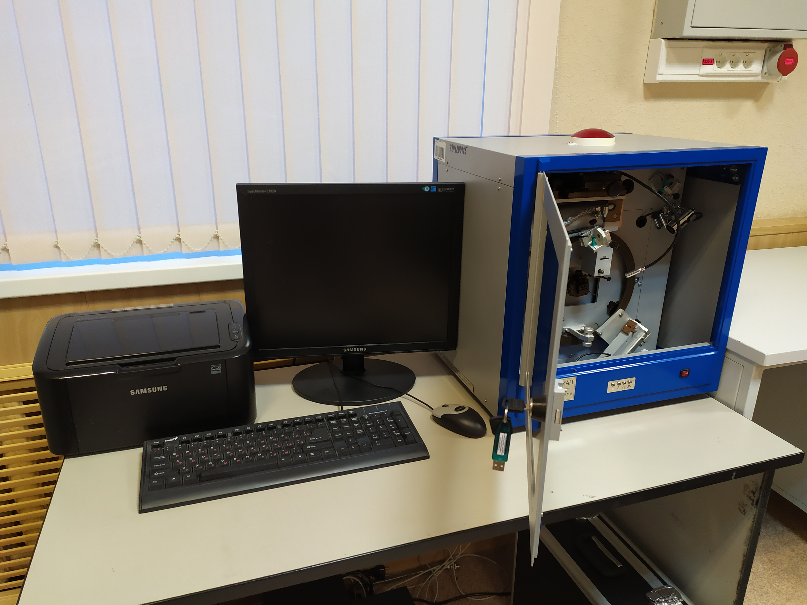
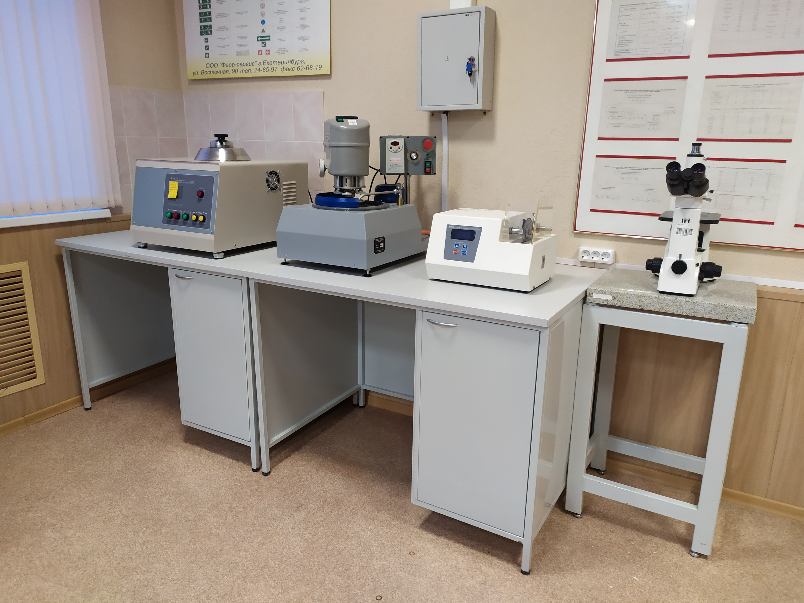
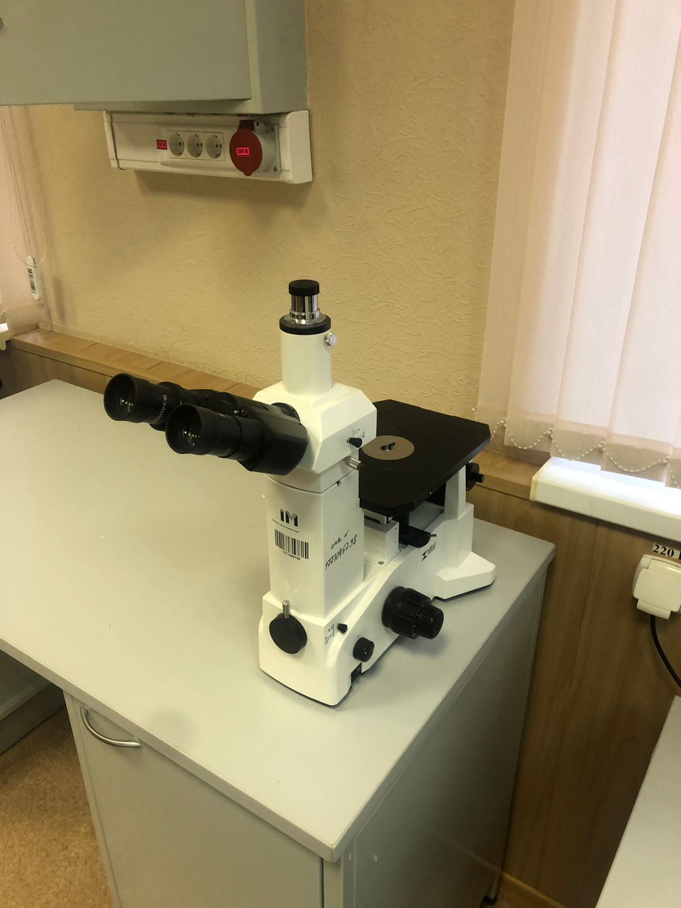
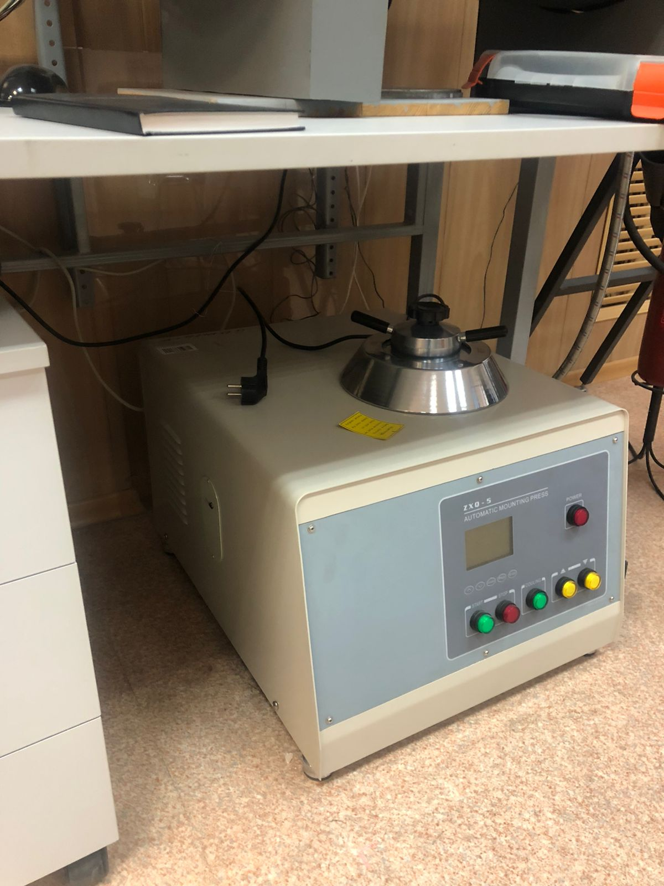
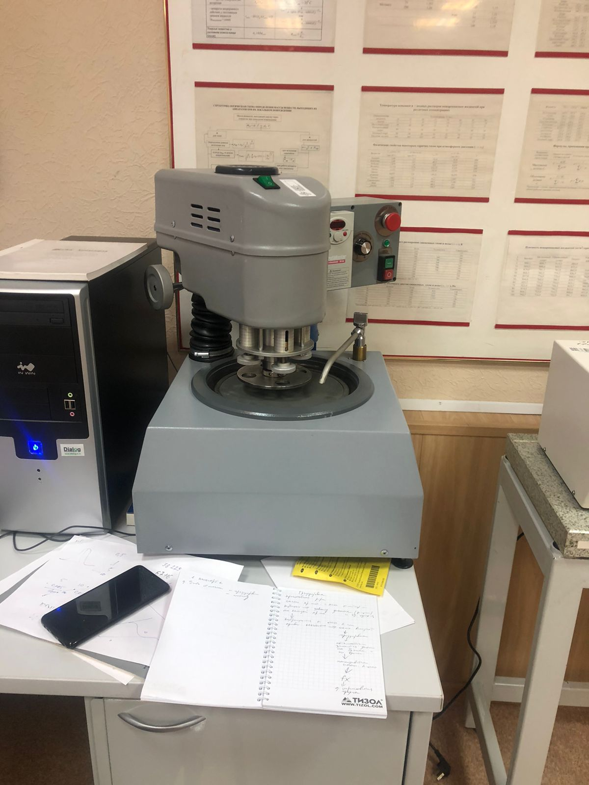
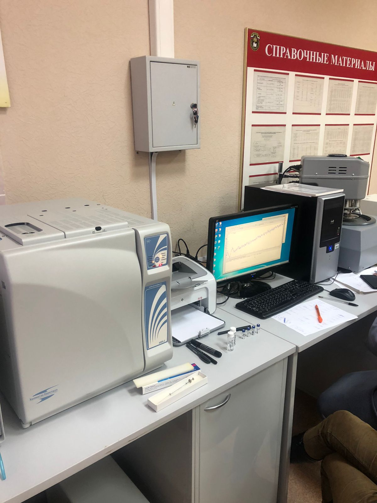

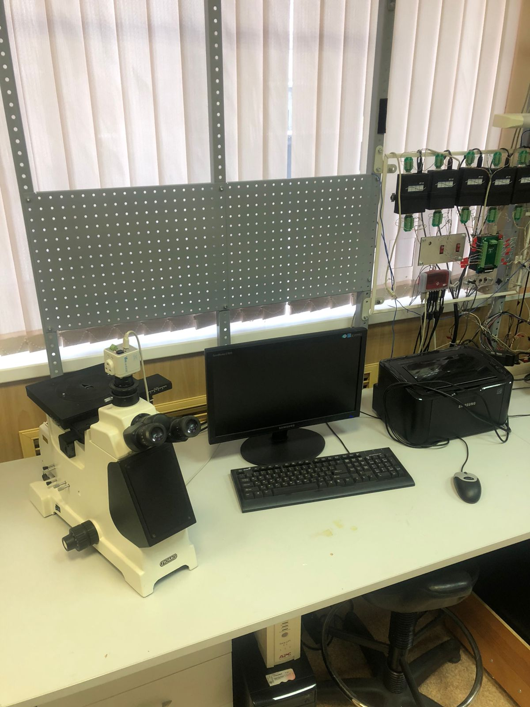
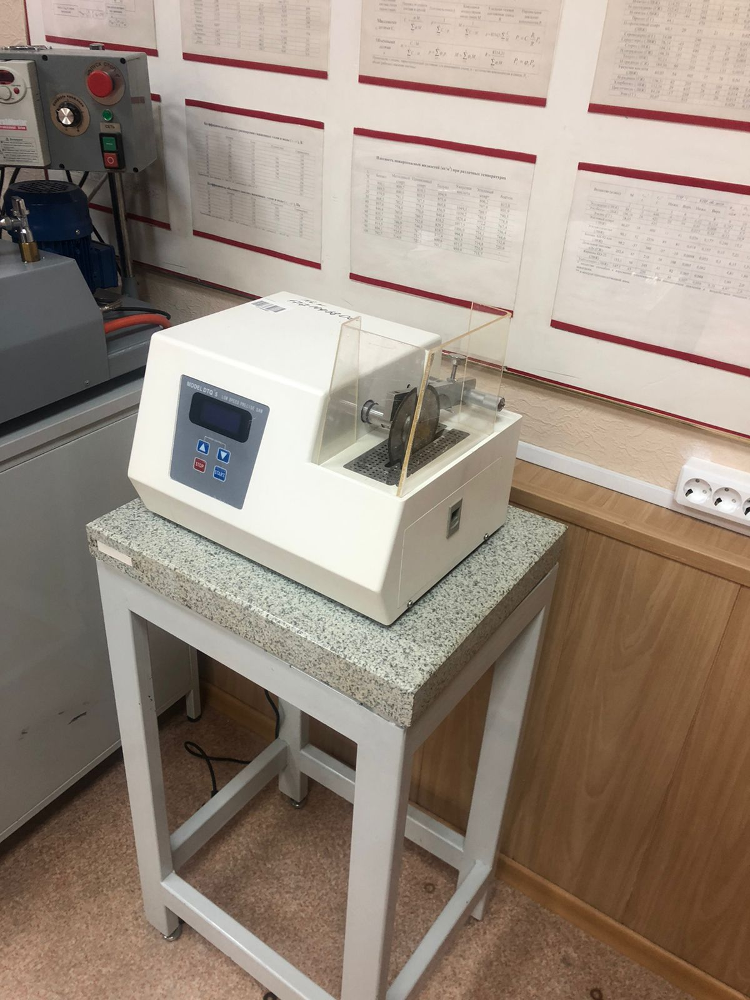

### Оснащение лаборатории инженерно-технических экспертиз позволяет отработать вопросы:
- осмотр места происшествия, в том числе пожара, с применением технических средств фиксации (криминалистическая фото-видео сьемка; выявление, фиксация и изъятие следов человека, автотранспорта и др.);
- особенности изъятия и упаковки следов-носителей криминалистически значимой информации;
- применение на практике криминалистических приборов и оборудования (ультразвукового дефектоскопа, коэрцитиметра, тепловизора и др.);
- исследование после пожара металлических (преимущественно стальных) конструкций, а также различных металлических крепежных изделий с целью установления на пожаре зон наибольших термических повреждений;
- поиск на месте пожара зон, в которых превышена концентрация газопаровоздушных смесей на основе ЛВЖ и ГЖ (используемых злоумышленниками в качестве инициаторов горения), а также определение концентрации паров светлых нефтепродуктов, спиртов, ацетона, аммиака;
- отработка версий о поджоге, поиск очага пожара, а также реконструкция возникновения и распространения горения, аварийных ситуаций;
- криминалистическая фото-видео сьемка;
- выдвижение следственных версий по составам правонарушений.
- производство нормативной пожарно-технической экспертизы (соответствие объекта исследования требованиям пожарной безопасности);
- производство следственных действий и особенности работы межведомственных СОГ.
